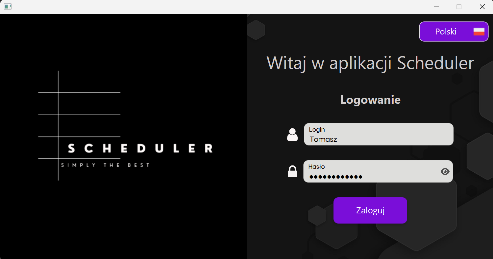
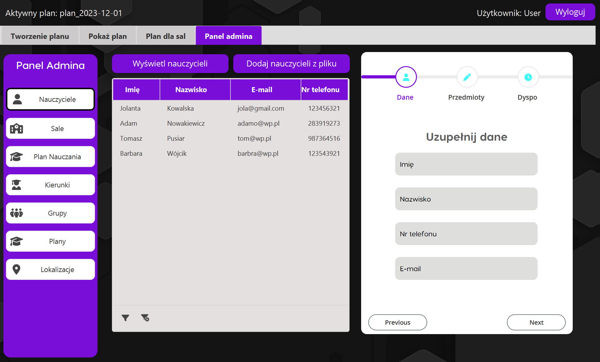
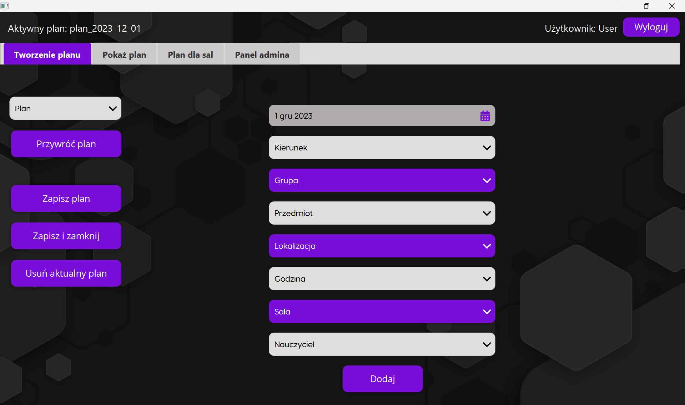
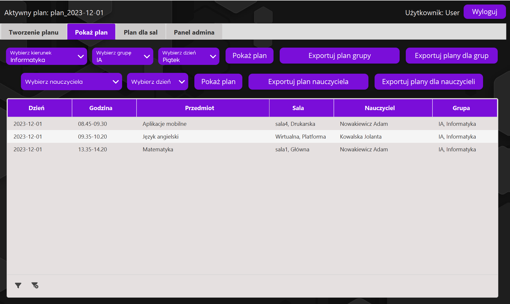
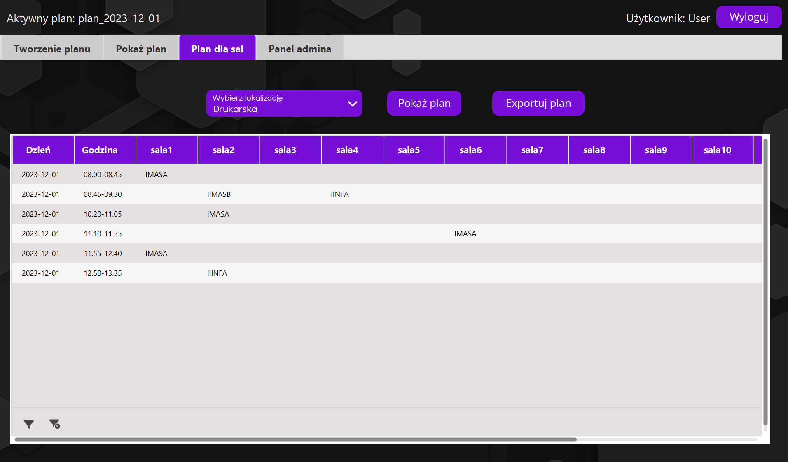
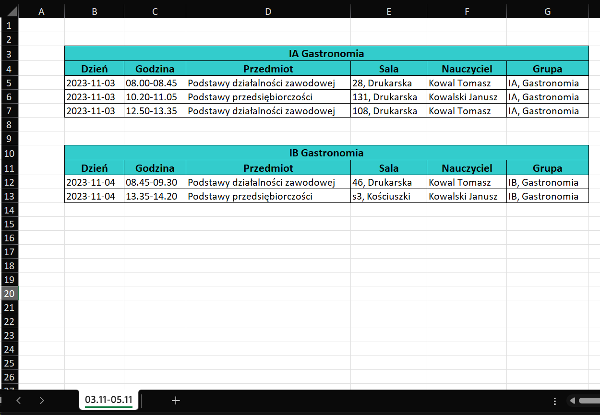

# SchedulerApp
## Opis aplikacji
SchedulerApp to aplikacja wspierająca proces tworzenia i zarządzania planami zajęć w szkołach policealnych. Program umożliwia także wprowadzanie, modyfikowanie i usuwanie danych, wykorzystywanych przy tworzeniu planów
oraz eksport planów do programu Microsoft Excel. Aplikacja została napisana przy użyciu takich technologii jak Kotlin,
JavaFX oraz baza danych MySQL.

### Logowanie
Na etapie logowania użytkownik może wybrać język, w jakim będzie
korzystał z aplikacji. Do dyspozycji są język angielski i polski.
Nowy użytkownik, podczas pierwszego logowania, ma możliwość zmiany hasła tymczasowego, dostarczonego przed administratora systemu.

<div style="text-align:center">

</div>

### Zakładka administratora 
Jest to zakładka, która zawiera wszystkie moduły potrzebne do wprowadzania i zarządzania danymi potrzebnymi do ułożenia planu zajęć. 
Dzieli się na 7 podzakładek, z których każda pozwala na działanie na innych obiektach, takich jak nauczyciele, sale, kierunki itp.

Jedną z podzakłdek jest moduł nauczycieli, przedstawiony na zdjęciu poniżej, który pozwala na wprowadzanie nowych nauczycieli, edytowanie ich, usuwanie, przeglądanie ich danych personalnych wraz z ich listą dyspozycyjności i przedmiotów itp.
Nauczycieli można dodawać pojedynczo za pomocą specjalnego formularza a także zbiorczo, załączając przygotowany plik Excel.
Wprowadzane i edytowane dane są poddawane weryfikacji, zapewniającej zgodność z ustalonymi wzorcami oraz eliminującej możliwość powstawania duplikatów.
Przy przeglądaniu danych nauczycieli możliwa jest także ich filtracja.

<div style="text-align:center">

</div>

Niektóre z pozostałych podzakładek w zakładce administratora dostarczają podobne funkcjonalności ale działają na innych obiektach takich jak kierunki kształcenia, grupy zajęciowe, loaklizacje. 
Natomiast inne pozwalają na kopiowanie planów na inne terminy w celu modyfikacji bez ingerencji w kopiowany plan, usuwanie planów, nadpisywanie szkolnych planów nauczania i inne.

### Zakładka tworzenia planu zajęć
Najważniejszą funkcjonalnością zakładki jest możliwość tworzenia planu zajęć.
Użytkownik tworzy za jej pomocą pojedyncze zajęcia i dodaje je do aktualnego planu.
Proces ten przebiega w taki sposób, że użytkownik po kolei wybiera dane potrzebne do ułożenia pojedynczych zajęć,
a system na bieżąco na podstawie wybranych danych umożliwia w kolejnych krokach wybór tylko tych danych, dla których nie istnieje możliwość ułożenia błędnego planu. 

Aplikacja dostarcza również wiele podpowiedzi, które ułatwiają tworzenie planu.

<div style="text-align:center">

</div>

### Zakładka planów zajęć
Jest to zakładka, która pozwala na wyświetlanie planu zajęć dla nauczyciela lub grupy, ich eksport do Excela
oraz modyfikację zajęć. Użytkownik może na wybranych zajęciach zmienić nauczyciela, godzinę, sale lub
całkowicie usunąć wybrane zajęcia. Plany można wyeksportować do Excela pojedynczo lub zbiorczo. Podczas modyfikowania wybranych zajęć system kontroluje i wyświetla tylko te dane, których wybranie nie spowoduje powstania błędnego planu.  
<div style="text-align:center">

</div>

### Zakładka planów dla sal
Jest to zakładka o podobnych funkcjonalnościach, co zakładka planów zajeć. Pozwala na wyświetlanie i eksportowanie rozkładu dla sal, który pomaga w zidentyfikowaniu jaka grupa ma zajęcia w jakiej sali o której godzinie.
<div style="text-align:center">

</div>

## Exportowane plany
Przykład wyeksportowanego planu do pliku Excel dla dwóch grup znajduje się poniżej.
<div style="text-align:center">

</div>

## Sposób uruchomienia
Aplikacja została stworzona i przetestowana pod systemem MS Windows 11.
Przed uruchomieniem aplikacji należy zainstalować serwer MySQL oraz stowrzyć bazę danych za pomocą dostarczonego pliku db.sql, za pomocą polecenia:
```bash
mysql -u root -p < db.sql
```

Najłatwiejszą opcją zainstalowania aplikacji jest użycie instalatora SchedulerInstaller.exe dla Windows.
Instalując aplikację w ten sposób nie jest wymagana instalacja JRE.
Aplikację można uruchomić także za pomoca polecenia:
```bash
gradlew build -x test run
```

W bazie danych istnieje testowy użytkownik o nazwie użytkownika *User* i haśle *Haslo1234*.
